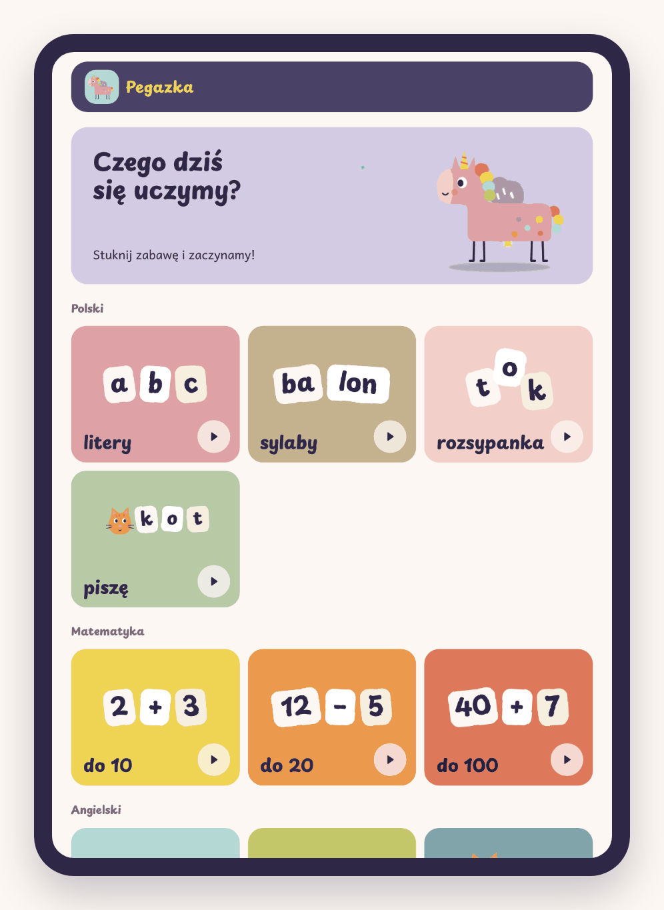
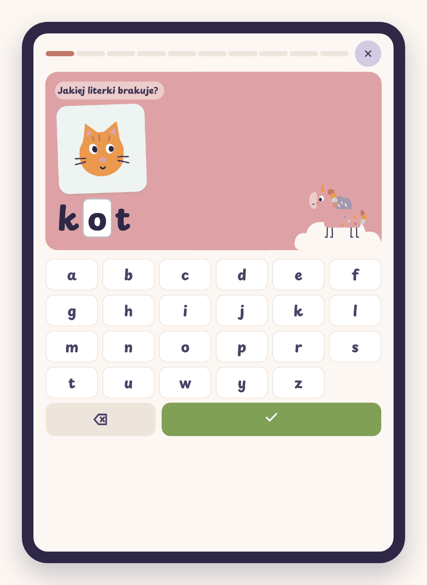
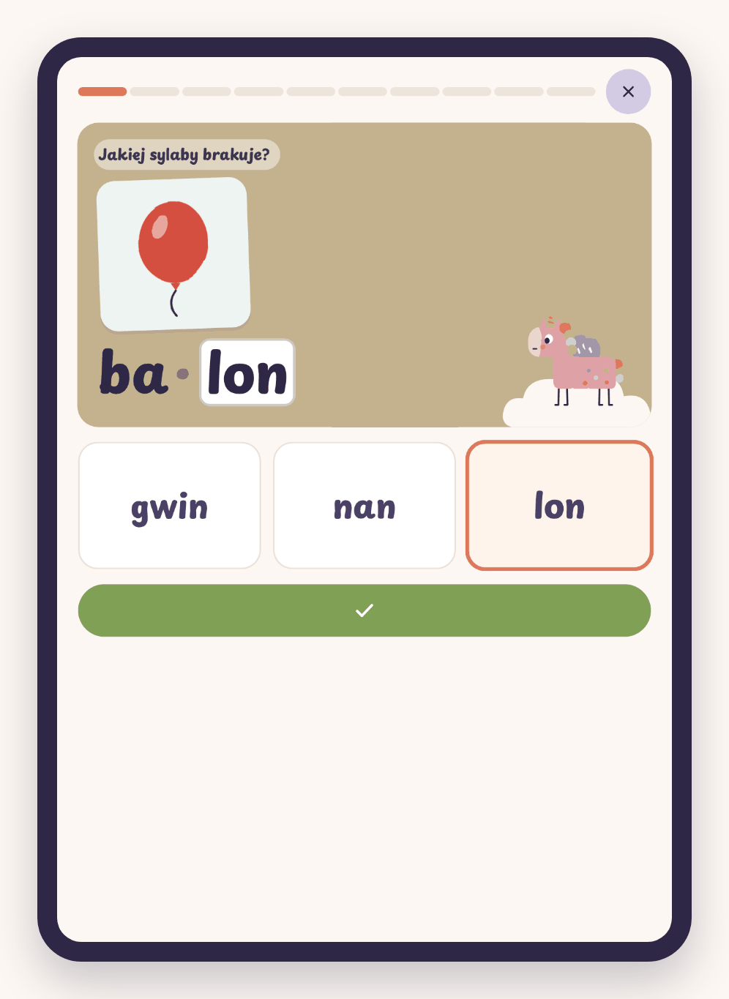
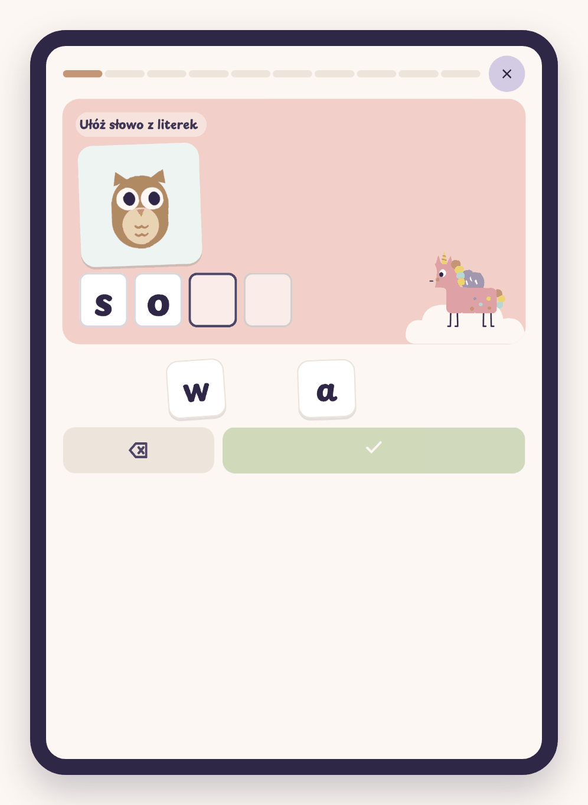
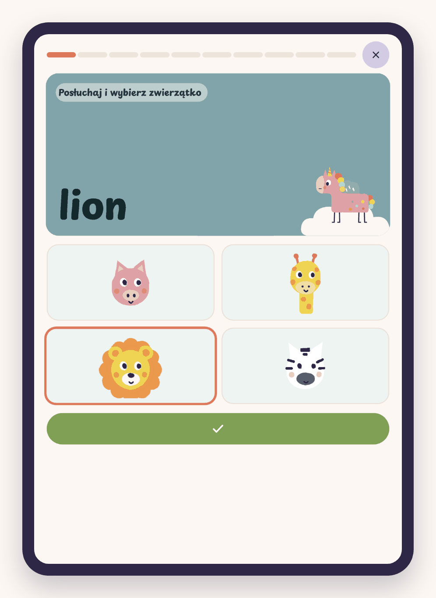
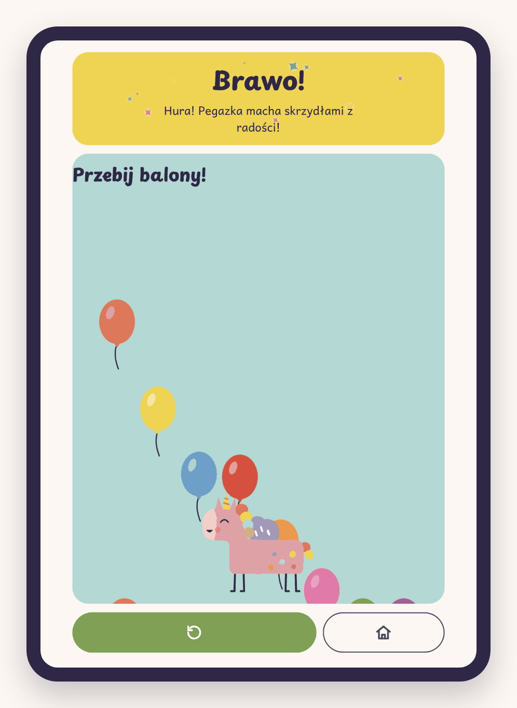
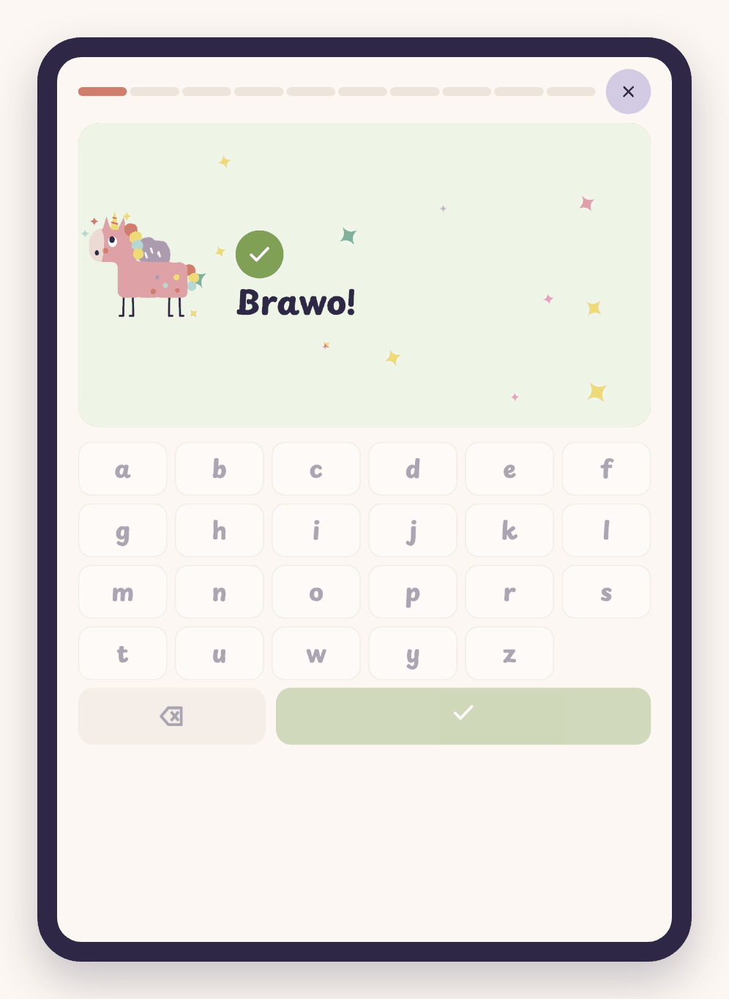
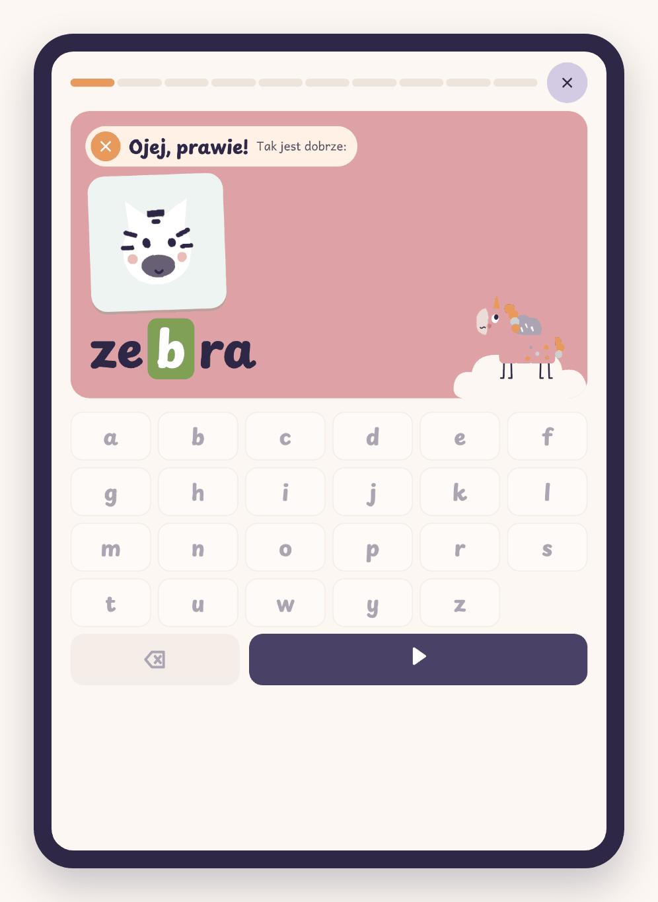
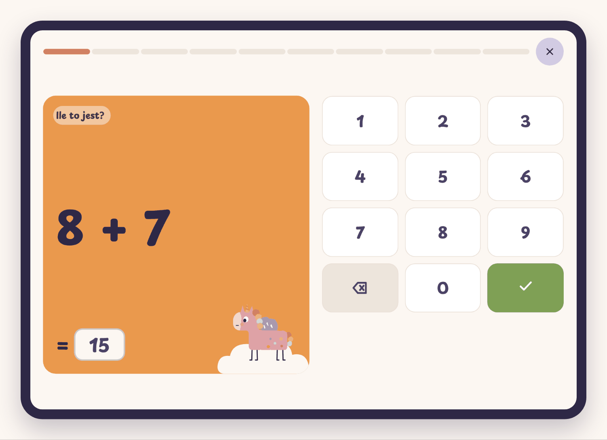

# Pegazka 🦄

Prosta apka do nauki dla dzieci z klas 1–3, zrobiona z myślą o tablecie.
Pegazka, różowa pegazorożka w stylu papierowej wycinanki, ćwiczy razem z dzieckiem
polski, matematykę i angielski.

Apka powstała na prośbę córki i jest zrobiona specjalnie dla niej.

**Apka:** https://danusiowa.github.io/pegazka/

## Jak wygląda

<table>
  <tr>
    <td align="center"> <b>Ekran główny</b></td>
    <td align="center"> <b>Litery</b></td>
    <td align="center"> <b>Sylaby</b></td>
  </tr>
  <tr>
    <td align="center"> <b>Rozsypanka</b></td>
    <td align="center"> <b>Angielski: zwierzęta</b></td>
    <td align="center"> <b>Niespodzianka po rundzie</b></td>
  </tr>
  <tr>
    <td align="center"> <b>Dobra odpowiedź</b></td>
    <td align="center"> <b>Błąd: dobra odpowiedź na zielono</b></td>
    <td></td>
  </tr>
</table>

 <b>Matematyka (tablet w poziomie)</b>

## Co jest w środku

### Polski
| Zadanie | Na czym polega |
|---|---|
| **litery** | Obrazek i słowo z luką (`k_t`). Dziecko wstawia brakującą literę z klawiatury na ekranie. |
| **sylaby** | Słowo podzielone na sylaby z jedną pustą (`ko · ?`). Dziecko wybiera sylabę z trzech klocków. |
| **rozsypanka** | Obrazek, słowo czytane na głos i pomieszane klocki z literami. Dziecko układa z nich słowo. |
| **piszę** | Obrazek, słowo czytane na głos i kratki na litery. Dziecko samo pisze krótkie słowo (3–5 liter). |

Tematy z ą, ę, ż i innymi literami z ogonkami oraz z dwuznakami (sz, cz, rz, ch, dz…) są gotowe,
ale na razie ukryte (`ukryty: true` w kodzie).

### Matematyka
Dodawanie i odejmowanie **do 10**, **do 20** i **do 100**. Wynik wpisuje się na dużej klawiaturze z cyframi.

### Angielski
| Zadanie | Na czym polega |
|---|---|
| **liczby** | Słowo czytane na głos (`four`). Dziecko wybiera obrazek z właściwą liczbą przedmiotów. |
| **kolory** | Słowo czytane na głos (`blue`). Dziecko wybiera właściwą plamę koloru. |
| **zwierzęta** | W dwie strony: obrazek → wybór napisu (każdy czyta się po stuknięciu) albo napis z dźwiękiem → wybór obrazka. |

## Jak działa

- **Powitanie:** po wejściu Pegazka wlatuje i mówi „Cześć!”. Stuknięcie pomija animację.
- **Ekran główny:** duże kafelki z rysunkami i prawie bez słów. Stuknięcie kafelka od razu zaczyna rundę.
  Pegazka co kilka sekund robi coś zabawnego (skacze, robi fikołka, rozgląda się, tańczy,
  zasypia, kicha brokatem, puszcza serduszka). Stuknięta też robi sztuczkę, po cichu.
- **Runda:** 10 zadań. Pasek postępu na górze, ✕ pozwala wyjść (z pytaniem, czy na pewno).
- **Po każdej odpowiedzi** od razu widać, czy było dobrze:
  - dobrze: „Super!”, krótki dźwięk, brokat i apka sama przechodzi dalej,
  - źle: dobra odpowiedź pojawia się na zielono w swoim miejscu, a ▶ prowadzi dalej.
- **Po rundzie:** pochwała i jedna z 16 losowych niespodzianek. Pięć ostatnich się nie powtarza.

  | Niespodzianka | Co robi dziecko |
  |---|---|
  | **Przebij balony!** | Przebija balony lecące do góry. |
  | **Złap bańki!** | Przebija bańki mydlane. |
  | **Serduszka dla Pegazki!** | Stuknięte serduszko leci do Pegazki, a ona podskakuje. |
  | **Zapal gwiazdki!** | Zapala gwiazdki na nocnym niebie. |
  | **Zaczaruj kamyki!** | Kamyki zamieniają się w kwiatki, motyle i inne skarby. |
  | **Otwórz prezenty!** | Otwiera paczki, w środku są łakocie i tęcza. |
  | **Przebieranki!** | Kostką zmienia strój Pegazki: królowa, czarodziejka, pilotka, leśna wróżka, kucharka. |
  | **Nowa fryzura!** | Wybiera kolory grzywy i ogona (tęcza, cukierki, morze, słońce). |
  | **Zerwij jabłka!** | Zrywa jabłka z drzewa do koszyka. Na koniec „Mniam, pyszności!”. |
  | **Zagraj Pegazce!** | Gra na cymbałkach, a Pegazka tańczy. |
  | **Wykąp Pegazkę!** | Zmywa plamy błota, piana znika i Pegazka błyszczy („Czyściutka!”). |
  | **Magiczna łąka!** | Tam, gdzie stuknie, wyrasta kwiatek. |
  | **Bal w zamku!** | Tam, gdzie stuknie w niebo, wybucha fajerwerk. |
  | **Skaczemy po chmurkach!** | Pegazka skacze na stukniętą chmurkę. |
  | **Fikołek!** | Każde stuknięcie to nowy fikołek. |
  | **Lecimy po tęczy!**, **Brokatowa burza!** | Spokojne scenki do oglądania. |

  W każdej niespodziance stuknięta Pegazka podskakuje. Niespodzianki się nie zbierają.
- **Bez wyników i rankingów:** nie ma punktów, czasu, procentów, kalendarza ani kont.

### Losowanie zadań
Każdy temat działa jak talia kart: zadania idą w losowej kolejności i nie wracają,
dopóki nie przewiną się wszystkie inne. Zadania z ostatniej rundy trafiają na koniec nowej talii.
W jednej rundzie nie ma powtórek ani „rodzin” działań (3 + 4, 4 + 3, 7 − 3 liczą się jak jedno).
Na tablecie zapamiętywane jest tylko to, co zostało w talii. To nie są wyniki dziecka.

### Dźwięk
- Słowa i polecenia czyta głos wbudowany w tablet. Apka wybiera najlepszy dostępny głos.
- Samo czyta tylko tam, gdzie dźwięk jest pytaniem: **piszę** (słowo ze słuchu) i angielskie „posłuchaj i wybierz”.
  W pozostałych zadaniach słowo czyta się po stuknięciu w obrazek, w głośnik albo w polecenie.
  Gdy tablet nie ma polskiego głosu, głośnik przy polskich poleceniach się nie pokazuje.
- Najlepiej brzmi ulepszony głos:
  - **iPad:** Ustawienia → Dostępność → Treść mówiona → Głosy → Polski → *Zosia (Ulepszony)*,
  - **Android:** Ustawienia → Ułatwienia dostępu → Zamiana tekstu na mowę → Google → zainstaluj polski głos.
- Krótkie dźwięki „dobrze / źle / koniec / pyk” generuje sama apka, bez plików i internetu.

## Uruchomienie

To jedna strona (`index.html`) bez instalacji i bez serwera.

1. GitHub Pages: **Settings → Pages → Branch: `main`, folder `/ (root)` → Save**.
2. Na tablecie otwórz adres apki i wybierz **„Dodaj do ekranu głównego”**.
   Pegazka pojawi się z własną ikonką i otworzy na pełnym ekranie.

Po zmianach w repo tablet może przez kilka minut pokazywać starą wersję.
Wtedy zamknij apkę całkiem i otwórz ponownie.

## Pliki

| Plik | Co to |
|---|---|
| `index.html` | Cała apka: wygląd, zadania, rysunki i logika |
| `manifest.json` | Nazwa, kolory i ikonki do „Dodaj do ekranu głównego” |
| `ikona-180.png`, `ikona-512.png` | Ikonki Pegazki |

## Jak coś zmienić

Wszystko jest w `index.html`, w części `<script>`:

- **Nazwa apki i imię maskotki:** stałe `NAZWA` i `IMIE` na początku skryptu.
- **Długość rundy:** `DLUGOSC_RUNDY` (domyślnie 10).
- **Nowy temat:** dopisz obiekt do listy `TEMATY` (rodzaje: `litery`, `sylaby`, `rozsypanka`,
  `pisanie`, `liczby`, `wybor`).
- **Ukrycie albo pokazanie tematu:** dodaj albo usuń `ukryty: true`.
- **Nowe słowo do literek:** dopisz je z luką w nawiasie, np. `"k[o]t"`.
- **Nowe słowo do sylab:** dopisz je z sylabami po myślniku, np. `"ba-lon"`.
- **Rysunki:** każde słowo potrzebuje rysunku w `OBR` (klucz to słowo bez polskich znaków,
  np. `zolw` dla „żółw”). Rysunki to płaskie kształty SVG w polu 100 × 100.
- **Kolory:** pastelowa paleta zapisana na początku stylów (`:root`).
- **Niespodzianki:** lista `NIESPODZIANKI` (tytuł, scenka i opcjonalnie coś na Pegazce).
  Stukanie w nie obsługuje `NIESP_AKCJE`.

## Zasady

- Nic nie zbieramy i nic nie wysyłamy: bez kont, bazy, analityki i reklam.
- Duże przyciski, mało słów, symbole zamiast napisów w nawigacji.
- Ciepły humor, bez rywalizacji i bez wytykania błędów.
- Apka szanuje ustawienie „ogranicz ruch”: wtedy animacje i brokat się zatrzymują.
